# CI/CD 与 GitHub Actions 配置完全教程

从概念到落地的系统性指南：理解 CI/CD 的本质，掌握 GitHub Actions 的完整配置语法，按「前端 / 后端」与「Java / Python / Node / Go」分栈落地，并能独立搭建生产级流水线。

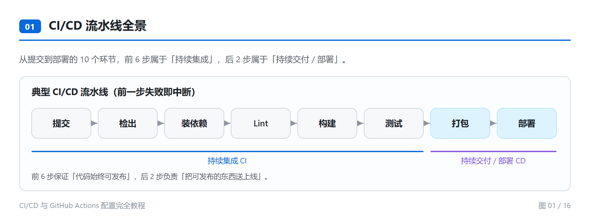

## 内容概览

| 项目 | 数量 |
| --- | --- |
| 正文章节 | 13 章 + 附录 |
| 正文行数 | 约 3200 行 |
| 流程图 | 16 张（内联 SVG，浅色主题） |
| 代码块 | 107 个 |
| 对照表格 | 23 张 |
| 可复用工作流示例 | 19 个 YAML |
| 端到端项目 | 6 个 |
| FAQ | 32 条 |

## 图示预览

### 一、执行模型

从事件触发到运行器执行的完整链路，以及 Job / Step 之间的隔离边界。

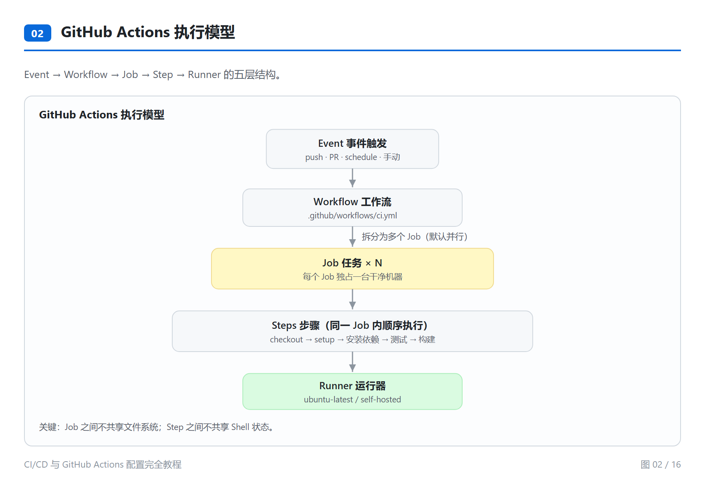

Job 之间默认并行，`needs` 决定串行，形成有向无环图：

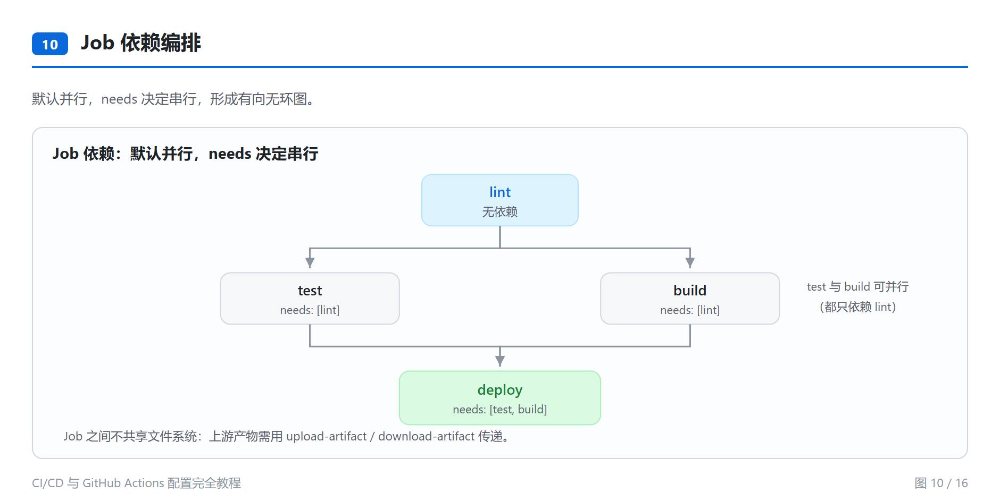

### 二、概念辨析

「持续交付」与「持续部署」都缩写为 CD，唯一区别是最后一步由人点确认还是自动执行。

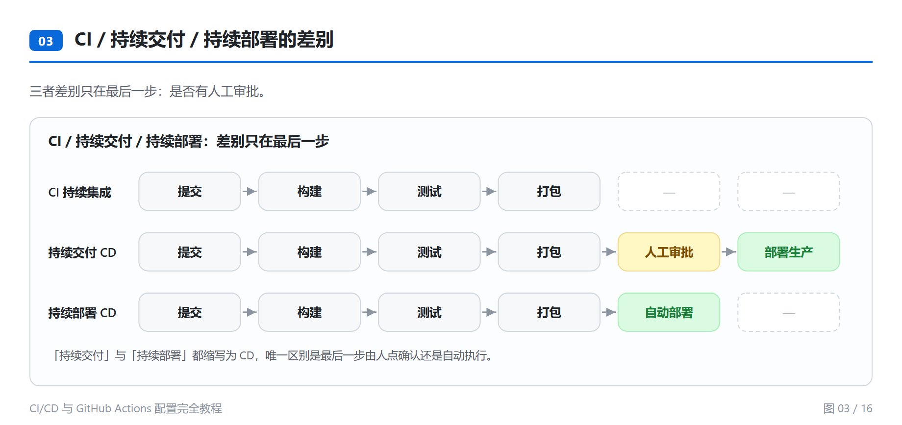

### 三、语法要素

`on` 的五种触发方式：

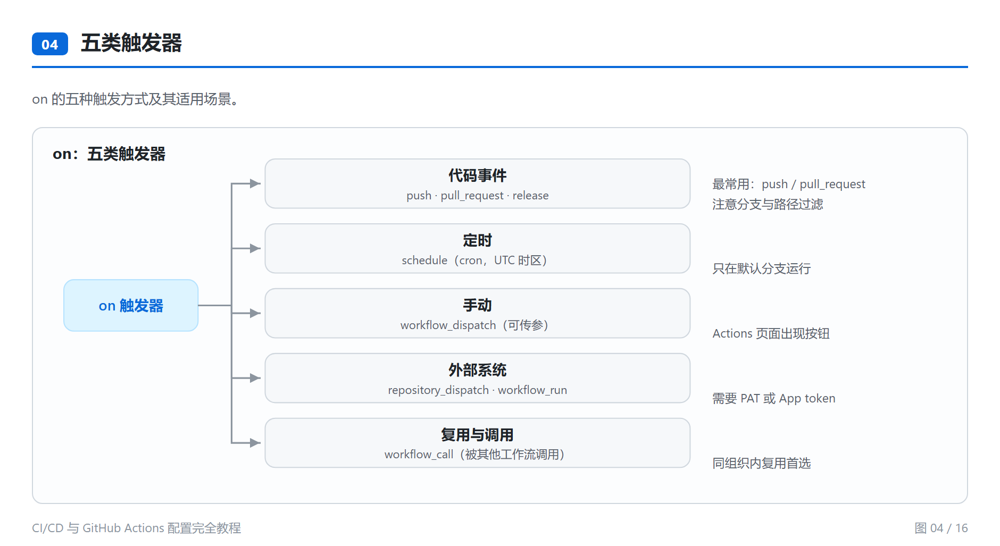

上下文经表达式求值后注入到各个使用位置：

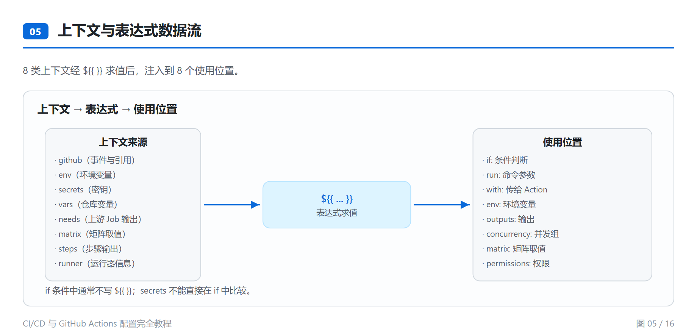

矩阵让一次定义展开为多组合并行：

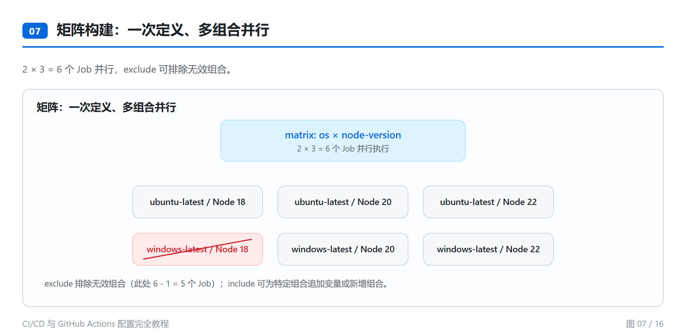

### 四、权限、缓存与产物

安全模型采用「组织/仓库 → Environment → Job → Step」四层，内层可覆盖外层：

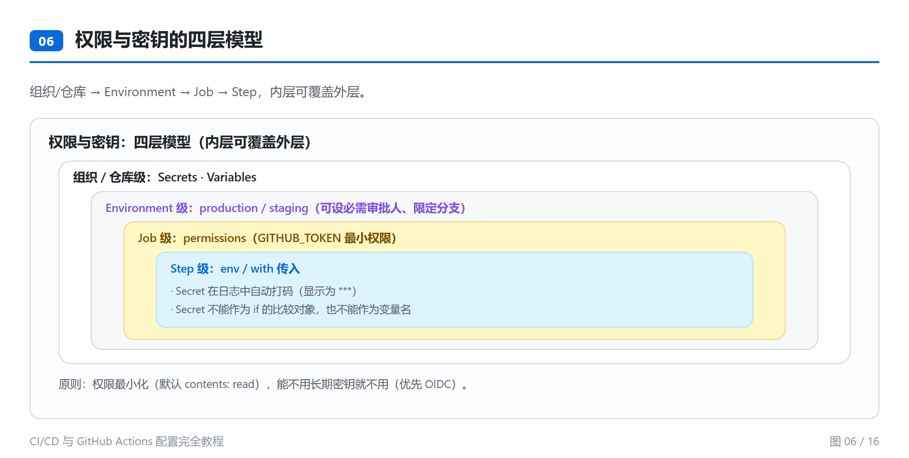

缓存命中走快路径，未命中走慢路径：

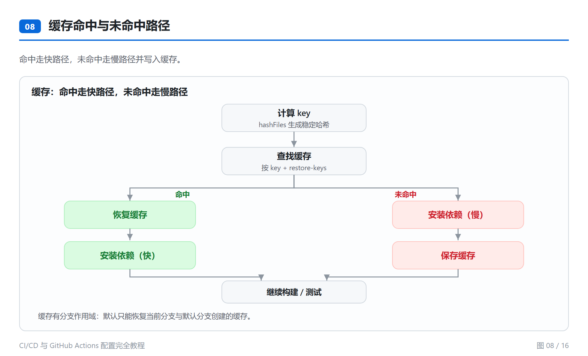

Cache 与 Artifact 目的完全不同——要「快」用 Cache，要「留」用 Artifact：

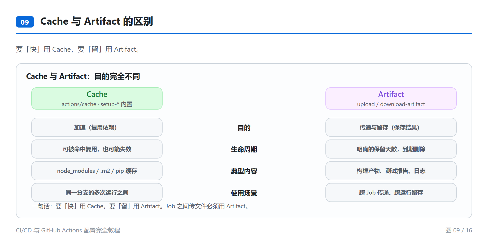

### 五、按技术栈分栈落地

前端交付「文件」，后端交付「进程 / 镜像」，因此缓存对象、产物留存、部署目标、门禁指标全部不同：

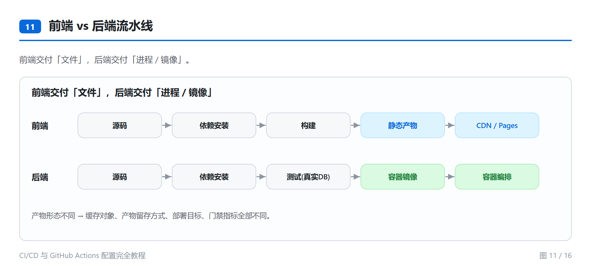

四栈从安装依赖到产出物的横向对照：

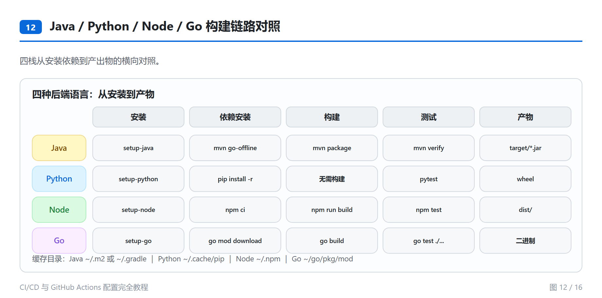

### 六、发布与排错

分支 → 环境 → 审批三者绑定的发布模型：

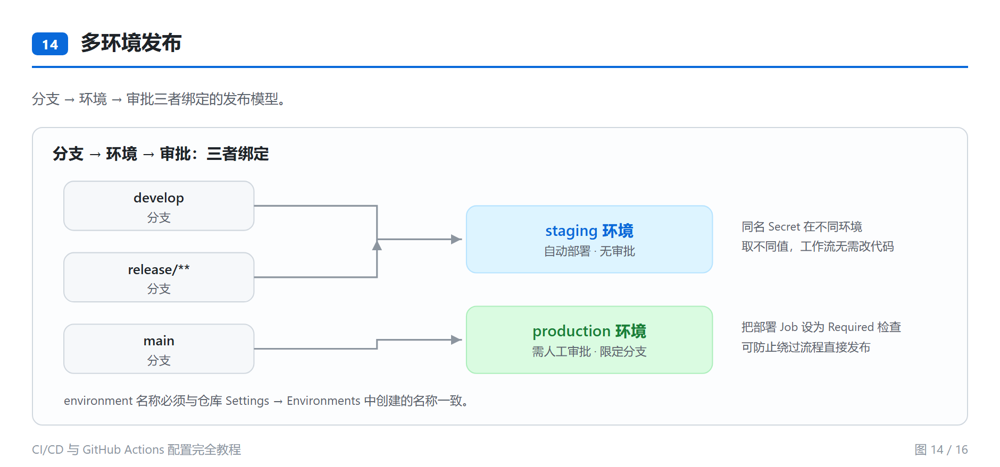

PR 预览环境从创建到销毁的完整生命周期：

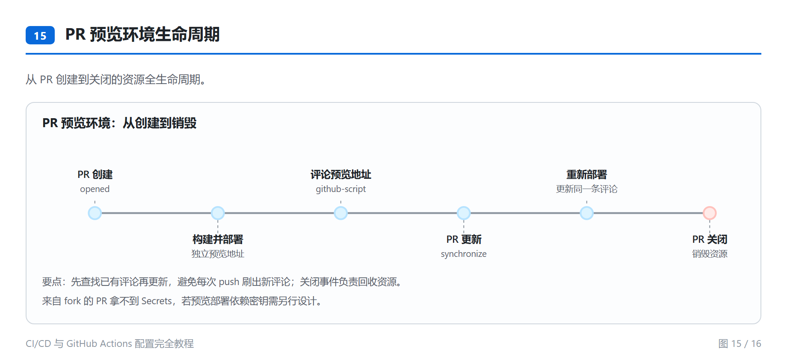

GitOps 模式下，CI 只产出镜像与清单，集群侧自动同步收敛：

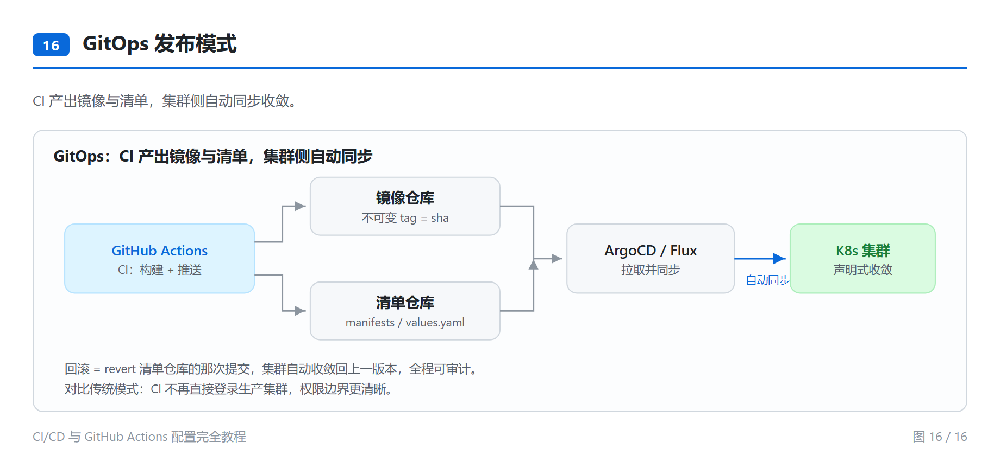

工作流异常的三类分支：没触发、Job 失败、部署异常：

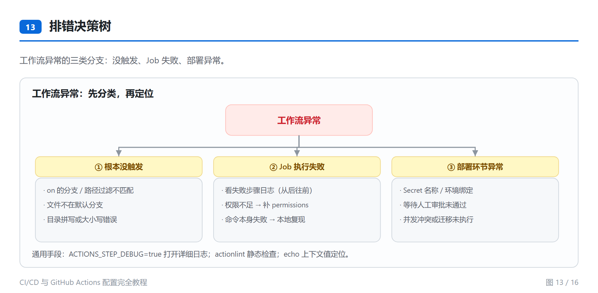

## 章节结构

| 章节 | 内容 |
| --- | --- |
| 第 1 章 | 什么是 CI/CD——CI / 持续交付 / 持续部署的区别 |
| 第 2 章 | GitHub Actions 概览——六大组件与执行模型 |
| 第 3 章 | 第一个工作流——目录结构与逐行讲解 |
| 第 4 章 | 工作流语法详解——触发器、jobs、steps、`strategy`、`services`、`container` |
| 第 5 章 | 核心概念深入——上下文与表达式、Secrets、权限、Workflow 命令、OIDC |
| 第 6 章 | 进阶特性——矩阵、缓存、产物、依赖编排、并发、表达式函数、YAML 锚点 |
| 第 7 章 | 实战示例（**按技术栈区分**）——前端 / Java / Python / Node / Go / 容器化 / 部署 |
| 第 8 章 | 复用与组织——可复用工作流、复合 Action |
| 第 9 章 | 安全与最佳实践 |
| 第 10 章 | 排错与调试 |
| 第 11 章 | 业界常见场景（14 个） |
| 第 12 章 | 完整项目实战（**6 个端到端项目**） |
| 第 13 章 | FAQ 常见问题（32 条） |
| 附录 A | 速查表、场景索引、技术栈索引 |

## 阅读方式

推荐打开 **`CI-CD-GitHub配置完全教程.html`**（含全部流程图与侧边目录，双击用浏览器打开即可）。

> 说明：本 README 中的图片是 16 张流程图的渲染版本；HTML 版内置的是矢量 SVG，缩放不失真。Markdown 源文件中对应位置为 `<!--DIAGRAM:xxx-->` 占位注释，在 GitHub 上不显示，请以 HTML 版或本 README 图片为准。

## 目录结构

```
.
├── CI-CD-GitHub配置完全教程.html   # 推荐阅读：含 16 张矢量流程图与侧边目录
├── CI-CD-GitHub配置完全教程.md     # 正文源文件
├── diagrams.py                     # 配图模块：16 张 SVG 的生成代码
├── build_html.py                   # 构建脚本：Markdown → HTML
├── shoot.py                        # 截图脚本：SVG → PNG（README 展示用）
├── images/                         # README 引用的 16 张 PNG（2 倍图）
└── examples/
    ├── README.md
    ├── github-workflows/           # 通用工作流（6 个）
    ├── github-actions/             # 复合 Action 示例
    └── projects/                   # 6 个端到端项目
        ├── 01-frontend-react-pages/
        ├── 02-backend-java-springboot/
        ├── 03-backend-python-fastapi/
        ├── 04-backend-node-express/
        ├── 05-pipeline-python-daily/
        └── 06-library-typescript-npm/
```

## 快速开始

### 使用示例工作流

把需要的文件复制到你的项目：

```bash
# 通用工作流
cp examples/github-workflows/ci-node.yml your-repo/.github/workflows/

# 或整个项目模板
cp -r examples/projects/04-backend-node-express/.github your-repo/
```

各示例目录下的 `README.md` 说明了需要配置的 Secrets 与占位值。

### 重新生成 HTML

修改 Markdown 后：

```bash
pip install markdown pygments
python build_html.py
```

### 重新生成 README 图片

修改 `diagrams.py` 中的图形后：

```bash
pip install pillow
python shoot.py                 # 重新渲染全部 16 张 PNG
python shoot.py 01-cicd-pipeline  # 只渲染指定的一张
```

### 新增一张图

1. 在 `diagrams.py` 中新增一个返回 SVG 字符串的函数，并注册到 `DIAGRAMS` 字典；
2. 在 Markdown 对应位置加入 `<!--DIAGRAM:图名-->`；
3. 在 `shoot.py` 的 `SPECS` 中追加一条记录（文件名、图名、宽度、标题、说明）；
4. 重新运行 `build_html.py` 与 `shoot.py`。

## 图目录

| # | 图名 | 文件 |
| --- | --- | --- |
| 01 | CI/CD 流水线全景 | `images/01-cicd-pipeline.png` |
| 02 | GitHub Actions 执行模型 | `images/02-actions-execution-model.png` |
| 03 | CI / 持续交付 / 持续部署的差别 | `images/03-ci-vs-cd-modes.png` |
| 04 | 五类触发器 | `images/04-triggers.png` |
| 05 | 上下文与表达式数据流 | `images/05-context-flow.png` |
| 06 | 权限与密钥的四层模型 | `images/06-security-model.png` |
| 07 | 矩阵构建 | `images/07-matrix.png` |
| 08 | 缓存命中与未命中路径 | `images/08-cache-flow.png` |
| 09 | Cache 与 Artifact 的区别 | `images/09-cache-vs-artifact.png` |
| 10 | Job 依赖编排 | `images/10-job-dag.png` |
| 11 | 前端 vs 后端流水线 | `images/11-frontend-vs-backend.png` |
| 12 | Java / Python / Node / Go 构建链路对照 | `images/12-backend-languages.png` |
| 13 | 排错决策树 | `images/13-troubleshooting-tree.png` |
| 14 | 多环境发布 | `images/14-multi-env.png` |
| 15 | PR 预览环境生命周期 | `images/15-pr-preview.png` |
| 16 | GitOps 发布模式 | `images/16-gitops.png` |

## 技术栈覆盖

- **前端**：React / Vue / Next.js / Nuxt / Angular
- **后端**：Java（Maven / Gradle / Spring Boot）、Python（pip / uv / Poetry / FastAPI / Django）、Node（Express / NestJS）、Go
- **部署**：GitHub Pages、CDN、Docker / GHCR、SSH、K8s + GitOps（ArgoCD / Flux）
- **移动端**：iOS（macOS runner + TestFlight）、Android（Gradle + APK）

## 官方参考

- 工作流语法：https://docs.github.com/actions/reference/workflow-syntax-for-github-actions
- 事件触发：https://docs.github.com/actions/reference/events-that-trigger-workflows

## 许可

本文档为技术教程，可自由用于学习与团队内部培训。
